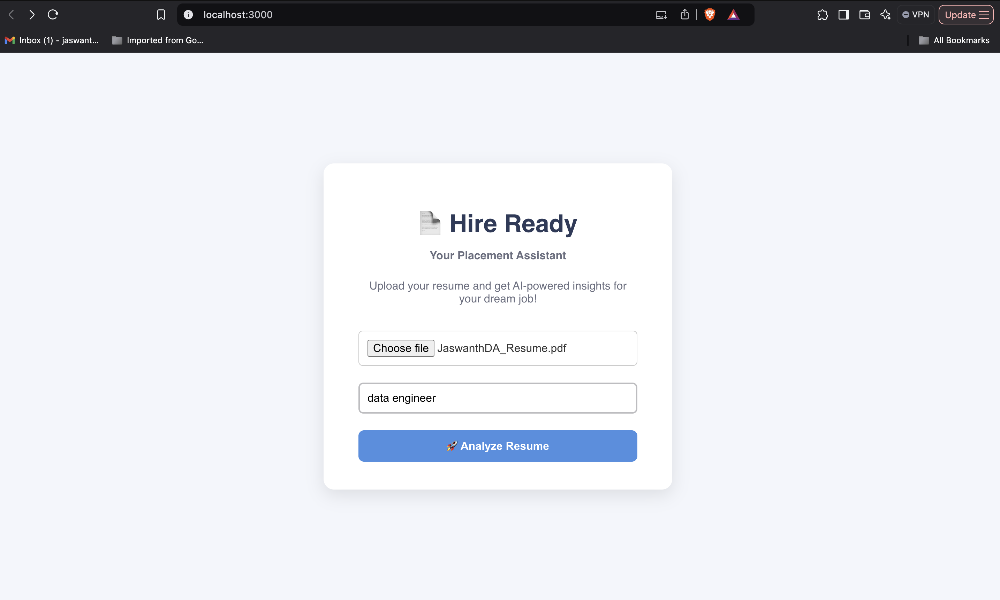
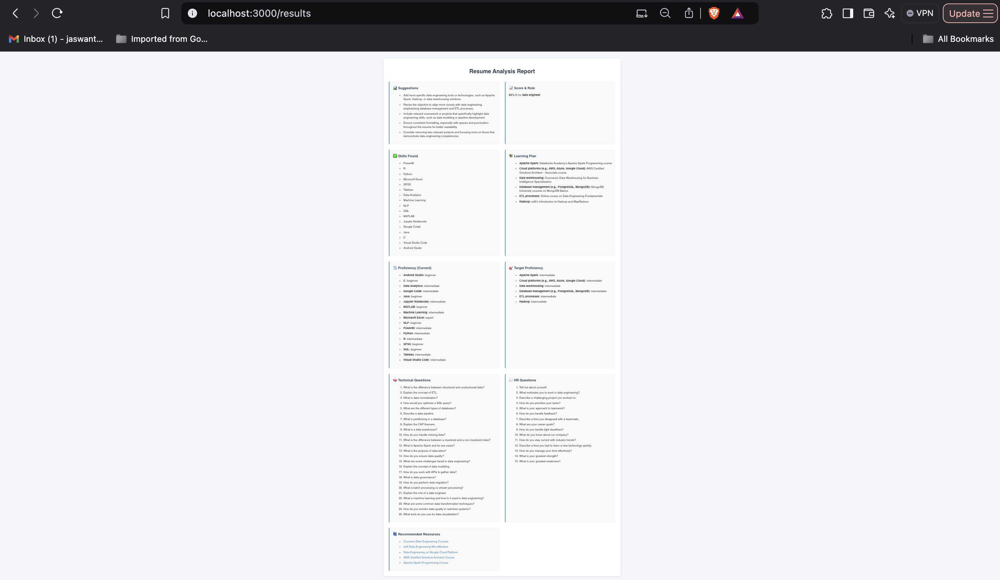
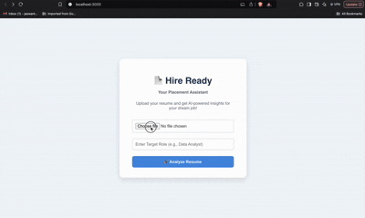

# 💼 Hire Ready – AI-Powered Resume Analyzer

Hire Ready is an AI-powered resume analysis tool that evaluates your resume for any job role, gives you targeted improvements, generates interview questions, and recommends personalized resources to help you get "Hire Ready"!

---

## 🔥 Features

✅ Upload your PDF resume  
✅ Enter your target role (e.g., `Data Analyst`)  
✅ Get 3–5 personalized suggestions  
✅ Resume-fit score (0–100%)  
✅ 50 technical interview questions  
✅ 30 HR interview questions  
✅ Handpicked learning resources  

---

## 📸 Demo Preview

### 🏠 Home Page


### 📊 Results Dashboard


### 📽️ Live Demo in Action


> 📁 All screenshots and demo files are stored in the `screenshots/` folder

---

## 🛠️ Tech Stack

- **Frontend**: React, Axios, Custom CSS
- **Backend**: Flask, Python
- **AI Engine**: OpenAI `gpt-4o-mini`
- **PDF Parsing**: pdfplumber
- **Styling**: Custom CSS

---

## 🚀 Getting Started

### 🧠 Prerequisite

- Python 3.x
- Node.js (v16 or above)
- npm

### 📦 Clone the Repo

```bash
git clone https://github.com/your-username/hire-ready.git
cd hire-ready

🔙 Backend Setup

cd backend
python3 -m venv venv
source venv/bin/activate
pip install -r requirements.txt
python app.py

💻 Frontend Setup

cd frontend
npm install
npm start

The frontend runs on http://localhost:3000
The backend runs on http://localhost:5000

⸻

🔐 API Key Setup

Your OpenAI API key is required.
In backend/app.py, replace:

OPENAI_API_KEY = "your-api-key"

⚠️ Don’t commit your key to public repos!

Use a .env file or environment variables in production.

⸻

🧪 Folder Structure

📁 frontend/   → React frontend
📁 backend/    → Flask backend
📁 screenshots/ → Images and demo GIF


⸻

👨‍💻 Developed By

Jaswanth Majjiga
🔗 LinkedIn Profile

⸻

📜 License

This project is licensed under the MIT License

⸻

🙌 Acknowledgments

Thanks to OpenAI for enabling personalized learning via LLMs.

